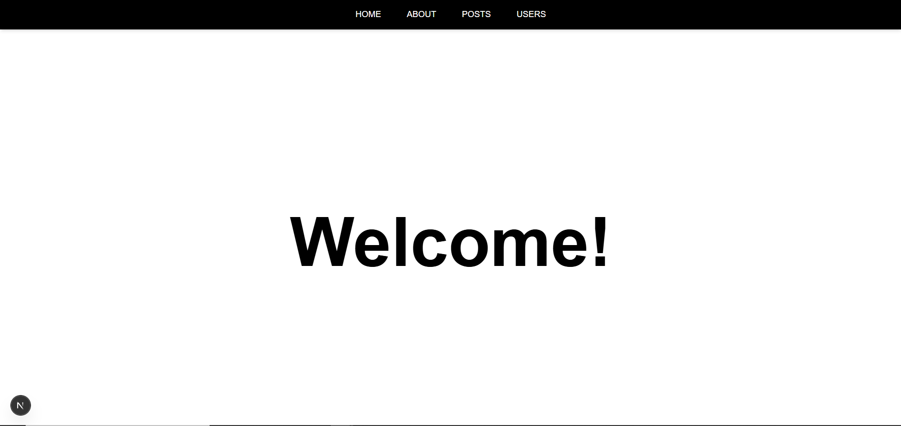
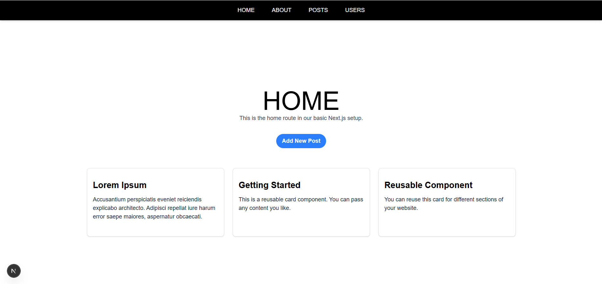
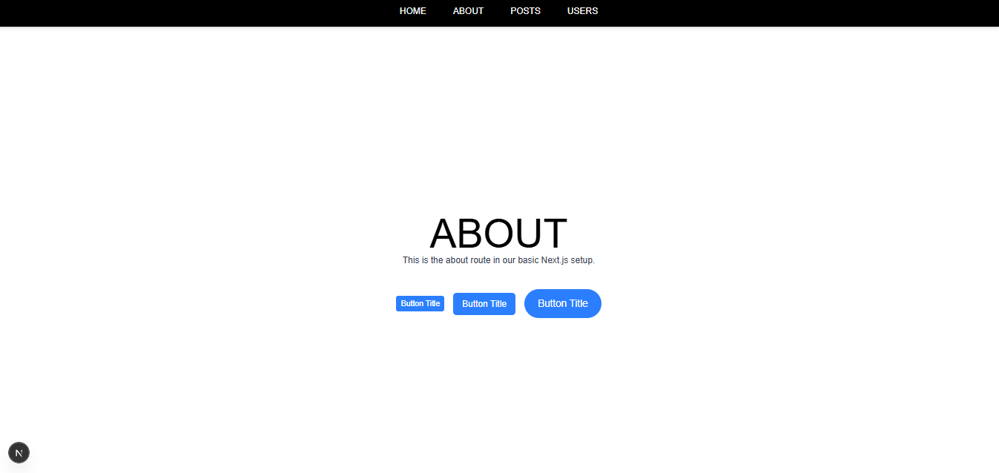
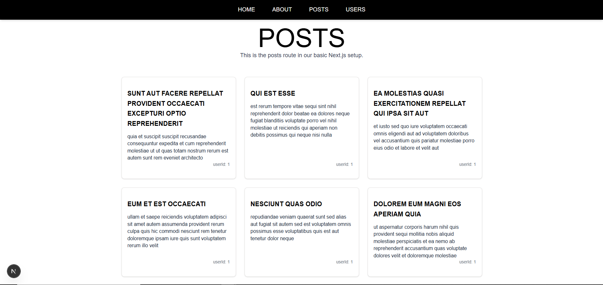
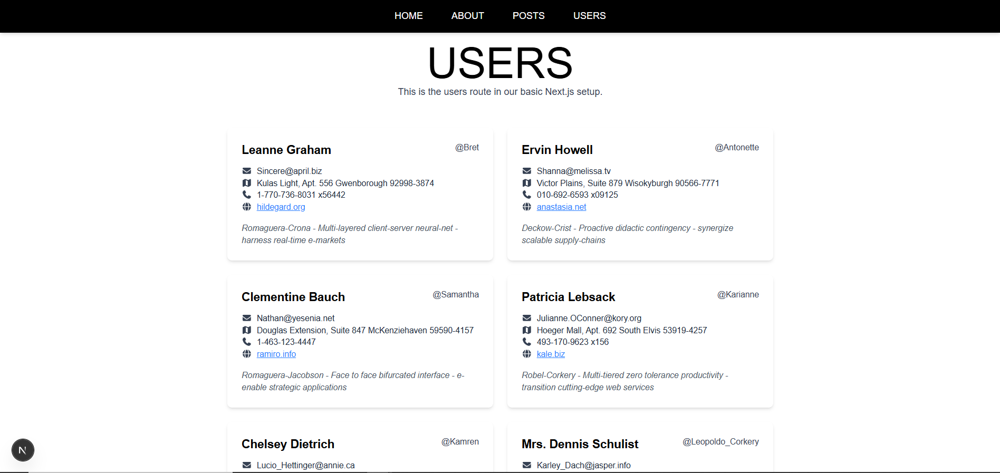

# Next.js Project Setup and Basics

This repository documents the setup and structure of a Next.js project scaffolded with TypeScript, Tailwind CSS, and ESLint.

## 📁 alx-project-2

- Configured with TypeScript and Tailwind CSS
- Includes reusable layout components (e.g., Header)
- Folder structure follows scalable conventions

## ⭕Screenshots








## 📂 Structure

```
alx-project-2/
├── components/
│ └── common/
│   └── Button.tsx
│   └── Card.tsx
│   └── PostCard.tsx
│   └── PostModal.tsx
│   └── UserCard.tsx
│ └── layout/
│   └── Header.tsx
├── interfaces/
│ └── index.ts
├── pages/
│ └── about.tsx
│ └── home.tsx
│ └── index.tsx
│ └── posts.tsx
│ └── users.tsx
├── public/
│ └── assets/
│   └── images/
│     └── ...(screenshots)
└── ...
```

## 🚀 Getting Started

```bash
npm install
npm run dev -- -p 3000
```
